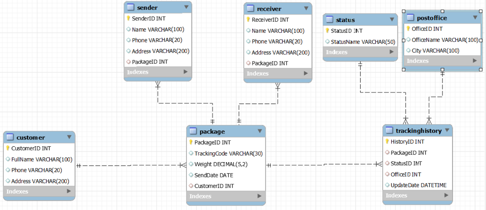

# Postal Tracking System Database

A relational database designed and implemented for a Postal Tracking System using MySQL.

## Features

- Customer management
- Sender and receiver management
- Package registration
- Unique tracking code generation
- Package status management
- Postal office management
- Tracking history recording
- Package search by tracking code
- Latest package status retrieval

## Database Entities

- Customer
- Package
- Sender
- Receiver
- Status
- PostOffice
- TrackingHistory

## ERD

## Technologies Used

- MySQL
- MySQL Workbench
- SQL